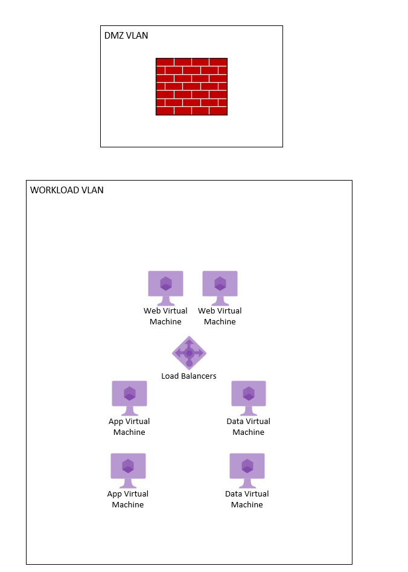

# Prologue - Planning for App Migration

Our story starts with an application that is running on-prem.  It is not a particularly complex nor critical application, and so our organization sees it as a viable workload to move to Azure.

This workload is located in its own dedicated VLAN on the on-prem virtualization environment.  While it receives internet traffic, there is a DMZ VLAN that contains firewalls and perimeter load balancers.

Inside of the dedicated VLAN, it has the following resources:

- A pair of virtual machines that house a web app, that communicates with...
- A pair of virtual machines that house a business logic application, that communicates with...
- A pair of virtual machines that run a data cluster.
- Load balancers are also deployed to load balance between similar nodes.

Our organization plans to perform a proof of concept of migrating this application to VMs with Azure.  This proof of concept has the following requirements and constraints:

- The application's architecture must follow a secure baseline.
- Traffic to the web application needs to come from the internet, but direct connection to the VMs over the internet should be forbidden.
- The VMs should be highly available.
- Azure native solutions should be favored (it is a proof of concept, after all!)
- Refactoring the application isn't on the table.
- The main goal is to understanding the networking fundamentals behind VM migration.  Additional proof of concepts for VM management and monitoring/logging will occur later.

With that, our team proceeds to dig in to planning the proof of concept!  First, they plan to deploy out [a stand alone virtual network in Act I.](act-1.md)
