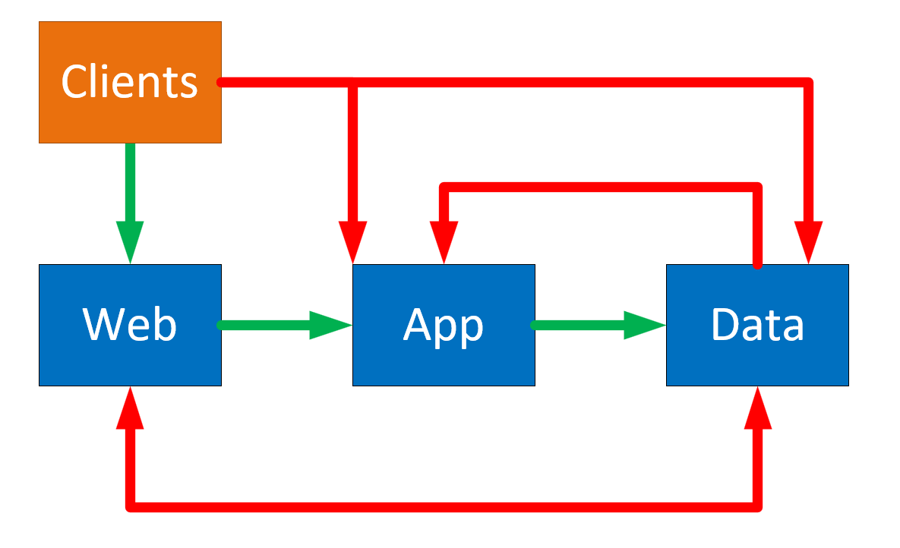
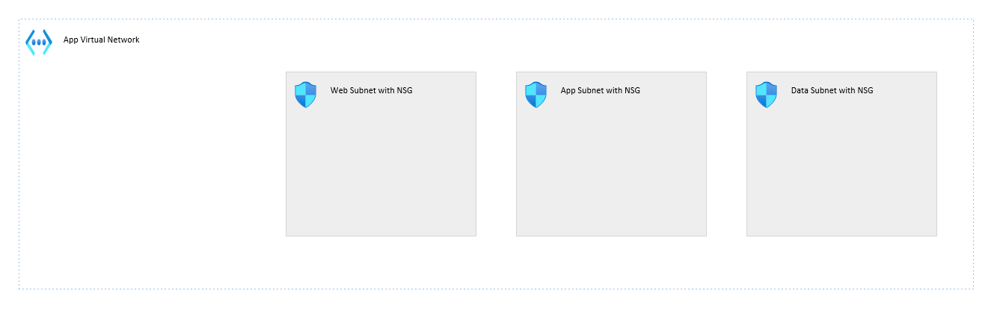
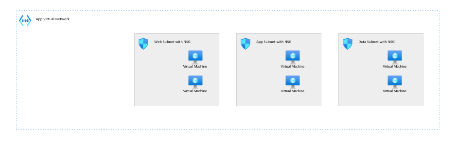
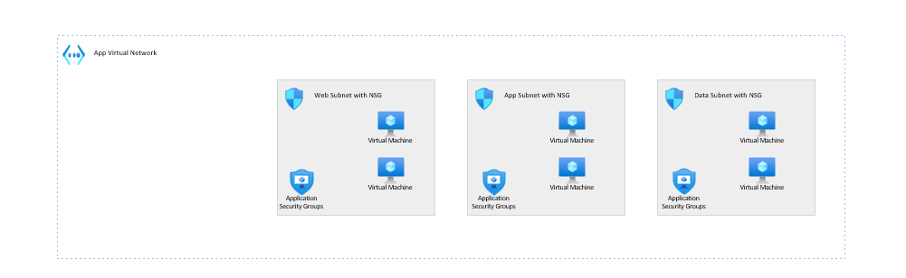
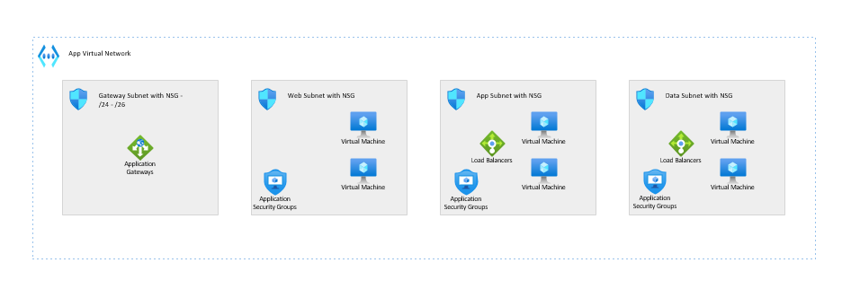
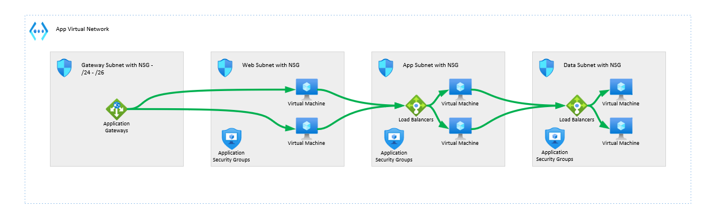
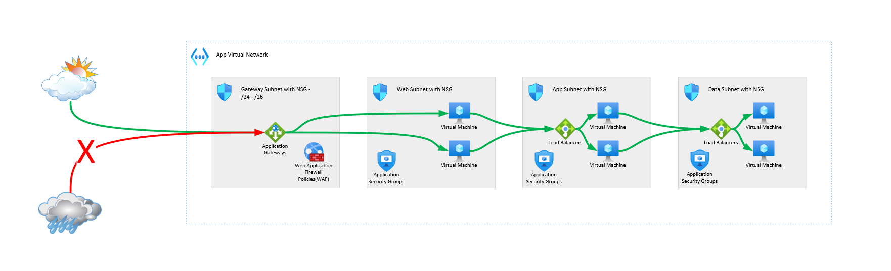

# Act I - Stand Alone Virtual Network

With the requirements understood from [the Prologue](./act-0.md), our proof of concept team begins to plan for their application networking.

## Deploying an Application Network

Our PoC team begins to whiteboard out the initial design for the application.  They identify that this is an [N-Tier application](https://docs.microsoft.com/azure/architecture/guide/architecture-styles/n-tier), and look at following that pattern.

### Segmentation Planning

First, they plan for a virtual network to house the application.  This virtual network is a stand alone IP space, that can be broken up in to subnets that are segments of that IP space.

Based on their review of the application, they identify that there are three tiers that need to be planned for:

To follow the secure baseline, only traffic that is required should be allowed.  The team begins to plan for communication that should happen:

They also make the following notes:

- The traffic from the clients to the web should be TCP 443
- The traffic from web to app should be on port 737
- The traffic from app to data should be port 1433
- VM management outbound communication will be allowed
- All other communication should be blocked

With this in mind, they sketch out the following network plan:

They plan to have a subnet for each tier.  This allows for clear network segmentation; when they see traffic coming from the IP space of a subnet, they will know what is being expected from that traffic.  Anomalous traffic will be easier to notice.  

For example, if something in the web subnet is trying to talk to the data subnet on 1433, then there is a misconfiguration or malicious activity is underway.  Either way, investigation and remediation will be needed.

### Network Security Groups

In addition, each subnet will have a [network security group](https://docs.microsoft.com/azure/virtual-network/security-overview) associated with it.  This network security group will allow for access control lists to be created that will shape the traffic.  The plan is for each of these NSGs to have rules for the specific function.  For example, the App subnet is intended to have the following rules:

- Allow inbound 737 traffic from the Web subnet's IP prefix to the App subnet's IP prefix
- Allow outbound 1433 traffic from the App subnet's IP prefix to the Data subnet's IP prefix
- Deny all other inbound traffic to the App subnet's IP prefix
- Allow outbound traffic for VM management points from the App subnet's IP prefix
- Deny all other outbound virtual network traffic from the App subnet's IP prefix

With this planned, they proceed to deploy the virtual networks and configure the rules.

Following recommendations, they also deployed [Network Security Group flow logs](https://docs.microsoft.com/azure/network-watcher/network-watcher-nsg-flow-logging-overview) and network insights, so that they could visualize the traffic and see what was happening inside their network.

Network security group (NSG) flow logs is a feature of Azure Network Watcher that allows you to log information about IP traffic flowing through an NSG. Flow data is sent to Azure Storage accounts from where you can access it as well as export it to any visualization tool, SIEM, or IDS of your choice.

### Virtual Machines and Application Security Groups

They proceed to deploy the virtual machines to the network; each virtual machine will have a virtual network interface card, which will be the resource that connects it to the internet.  They deploy the resources to each of the virtual networks, and begin inspecting the resources.

As they are deploying the virtual machines, they realize they have another method to use for the rules: [Application Security Groups](https://docs.microsoft.com/azure/virtual-network/application-security-groups).

A VM's NIC can be associated with one or more application security groups.  These groups can then be used as part of the NSGs, to provide more specific rule control than just the subnet.

They decide to associate each tier with a specific ASG, and then to update the rules.  They also decide to create an All VMs ASG.

Their new rules for the App subnet's NSG look like this:

- Allow inbound 737 traffic from the Web ASG to the App ASG
- Allow outbound 1433 traffic from the App ASG to the Data ASG
- Deny all other inbound traffic to the All VMs ASG
- Allow outbound traffic for VM management points from the All VMs ASG
- Deny all other outbound virtual network traffic from the All VMs ASG

They order these with proper priority, so that the specific allows are a higher priority than the more general denies.

### Service Tags

As part of their plan for VM deployments, our team wants to plan for some basic VM logging.  Boot diagnostic logging for VMs are stored in a storage account.

The team decided to start with the use of an outbound rule on the NSG to the storage accounts.  However, the storage account services have a wide variety of IP addresses.  Trying to maintain those would create issues for management.

Instead, they opt to use a [Service Tag](https://docs.microsoft.com/azure/virtual-network/service-tags-overview) on the NSG.  Service tags allow them to specify Azure services for an NSG or firewall rule, instead of having to set things for specific IPs.  With this rule in place, it was straight forward for the team to enable outbound connections to the storage accounts.

### Service Endpoints

However, after further discussions with the security team, it was identified that some new requirements were being discovered:

- Virtual Machine traffic to storage accounts should not use public access
- Storage accounts should be configured to only allow specific ingress

After some investigation, the PoC Team identified that [service endpoints](https://docs.microsoft.com/azure/virtual-network/virtual-network-service-endpoints-overview) would be a good fit.  A service endpoint is a specific configure that allows a specific virtual network to communicate with a service over the Azure backbone.

In this case, they could configure service endpoints for storage in the VM subnets to allow the VMs to communicate privately with the storage account.  In addition, the storage account could be set to only allow inbound traffic from those virtual networks.

While accessing the storage account to retrieve the logs would still use a public ingress rule set for their corporate public NAT, security was OK with proceeding with the proof of concept.

### Load Balancing

With the virtual machines deployed and secured, the team now turned their attention to having the application work.  They identified that they would need some load balancer resources to balance between individual VMs.

Because there are different resources available for load balancing, they referenced the [Azure Load Balancing Decision Flow](https://docs.microsoft.com/azure/architecture/guide/technology-choices/images/load-balancing-decision-tree.png) to decide what to use.  Based on that information, they identified that:

- The web VMs would use an [Application Gateway](https://docs.microsoft.com/azure/application-gateway/overview), because it was single region, inbound web traffic
- The App and Data VMs would leverage [Azure Internal Load Balancers](https://docs.microsoft.com/azure/load-balancer/load-balancer-overview), because there was non-web traffic being used inside of a single region

While the Load Balancers could be deployed in the same subnets as the VMs, the Application Gateway would need its own dedicated subnet.

They proceeded to deploy out the resources:

This did require them to change their NSG rules, however - they would need to allow traffic to occur not from VM to VM, but from VM to load balancers.

With the rule changes, their Application subnet NSG had the following rules:

- Allow inbound 737 traffic from the Web ASG to the App Load Balancer IPs
- Allow inbound 737 traffic from the App Load Balancer IPs to the App ASG
- Allow outbound 1433 traffic from the App ASG to the Data Load Balancer IPs
- Allow outbound 1433 traffic from the Data Load Balancer IPs to the Data ASG
- Deny all other inbound traffic to the All VMs ASG
- Allow outbound traffic for VM management points from the All VMs ASG
- Deny all other outbound virtual network traffic from the All VMs ASG

They also found that because the App Gateway had public inbound and outbound traffic needs, it needed a specialty NSG with the following rules:

- Allowing inbound traffic from the Gateway Manager service tag to a destination of any, on ports 65200-65535
- Allowing inbound traffic from the Internet service tag, to the Application Gateway, on port 443
- Allowing outbound traffic from the Azure Load Balancer service tag to a destination of any, on ports 443
- Allowing outbound traffic from the IP address prefix of the Application Gateway subnet, to the Web ASG

Which meant that with the traffic would flow correctly from all resources:

### Web Application Firewalls

After this deployment, the team realized that the Application Gateway had additional functionality.  It could be deployed to act as a [Web Application Firewall](https://docs.microsoft.com/azure/web-application-firewall/ag/ag-overview) in addition to a web balancer.

As a Web Application Firewall, or WAF, they could inspect incoming traffic for common attacks from the OWASP Top 10, and other WAF rules.  This would help protect their web application from SQL injection, cross site scripting attacks, and other malicious attempts at bringing down their application, or exposing their data.

By upgrading the SKU of their Application Gateway, they were able to promote it to a Web Application Firewall.

## In Conclusion

Our PoC team completed an initial proof of concept of the networking for their web app by...

- Identifying that the application operated as an [N-Tier application](https://docs.microsoft.com/azure/architecture/guide/architecture-styles/n-tier)
- Deploying a segmented virtual network with distinct segments for application tiers

- Using [Network Security Group](https://docs.microsoft.com/azure/virtual-network/security-overview) to create traffic rules to the least required permissions
- Enabling [Network Security Group flow logs](https://docs.microsoft.com/azure/network-watcher/network-watcher-nsg-flow-logging-overview)
- Using [Application Security Groups](https://docs.microsoft.com/azure/virtual-network/application-security-groups) to allow for the tagging of VMs by tiers
- Using [Service Endpoints](https://docs.microsoft.com/azure/virtual-network/virtual-network-service-endpoints-overview) and [Service Tag](https://docs.microsoft.com/azure/virtual-network/service-tags-overview) to secure access to storage accounts
- Referencing the [Azure Load Balancing Decision Flow](https://docs.microsoft.com/azure/architecture/guide/technology-choices/images/load-balancing-decision-tree.png) to decide on the right load balancing solutions for their workload
- Deploying an [Application Gateway](https://docs.microsoft.com/azure/application-gateway/overview) to service as inbound web load balancing and to serve as a [Web Application Firewall](https://docs.microsoft.com/azure/web-application-firewall/ag/ag-overview)
- Using [Azure Internal Load Balancers](https://docs.microsoft.com/azure/load-balancer/load-balancer-overview) to load balance non-web traffic

With the completed PoC, there began to be more discussions about how to move forward.  The primary networking team had been planning something called a Hub network to hold additional services, and there were security requirements from that initiative that would impact how the web application would function.

[To be continued in Act II](act-2.md)
